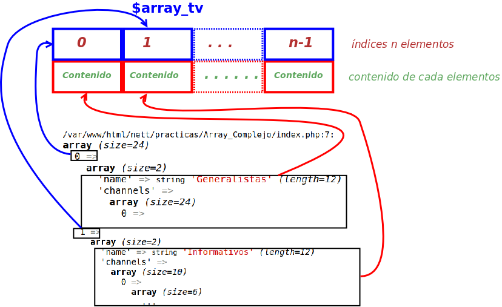
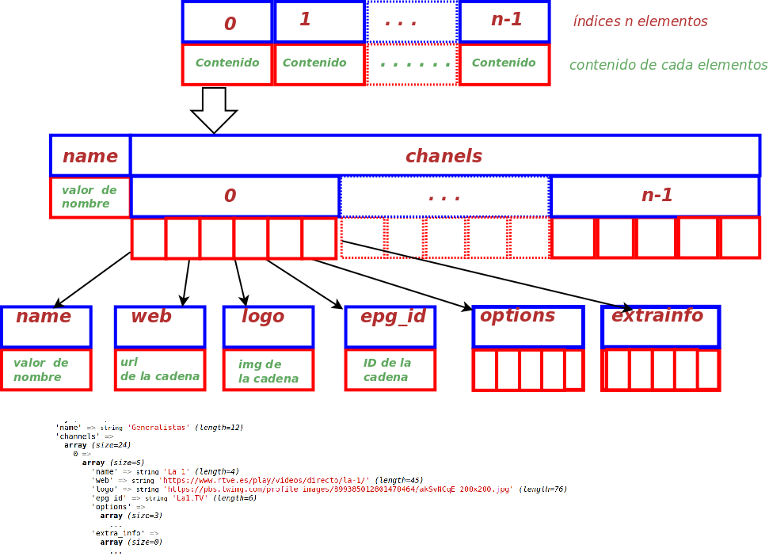

# Recorrido de un array complejo

Se ha localizado un json en internet que tiene información de cadenas de tv.

En la información se observa que tiene una referencia a la web donde se emiten los programas, además de  la url de la imagen del programa y otros datos.

Se quiere hacer un programa en php para recorrer el array, mostrando la información de la siguiente manera:
una Img con el logo de la cadena que sea un ancla a la web de la misma.

Todo ello agrupado por temáticas.

## Pasos a hacer
Lo  primero copiamos el fichero json y lo traemos a nuestro proyecto [tv.json](./tv.json)

A continuacioń escribmos el código para convertir el json en un array, usando la función 


```php
//Cargamos el contenido de un fichero en una variable
$contenido = file_get_contents("./tv.json");

//Convertirmo el json en un array asociativo
$array_tv = (array)json_decode($contenido, true);

```
Ahora toca ver el contenido del array y entenderlo. Para ello realizamos var_dump y analizamos la estructura.
Tras hacerlo  he realizado un dibujo para intentar dejar clara la estructura del array. Una vez que esté clara decidiremos qué información nos interesa y cómo obtenerla.






