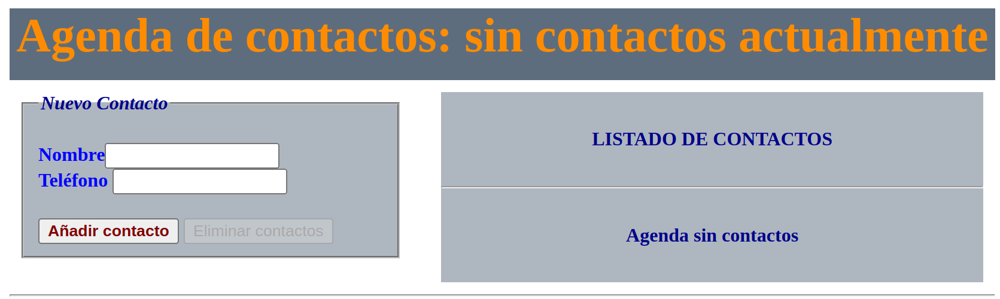
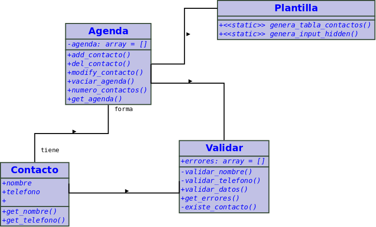

# Diseño de interfaz gráfica
Realizamos un diseño de interfaz gráfica
En este caso, vamos a usar la pantalla ofrecida por la propia práctica. Para lo cual accedemos a la web donde se puede ver la práctica funcionando.

| Comentar que este diseño no es bueno, no es responsivo ni está basado en ningún framework de diseño, por lo que no es un diseño que se pueda usar en un proyecto real.
Para tener este diseño, simplemente nos copiamos el css del proyecto, el código html del mismo y lo usamos para nuestro ejemplo, por lo que tendremos un fichero ***index.html*** y una carpeta ***css/estilo.css***
Actualizamos la línea del index, para que carge el estilo de la nueva ubicación
```html
    <link rel="stylesheet" href="./css/estilo.css" type="text/css">
```
# Creación del código
## Estructura de  las clases
Siguendo con la línea planteada en la clase, vamos a realizar un diseño de clases como se muestra en la imagen sigueinte:



Justificación de las clases

1. Agenda
2. Contacto
3. Validar
4. Plantilla

## Empezando a escribir el código
Vamos a realizar una programación de mancha de aceite combinando la abtración general con la abstracción detallada.
No hemos visto pruebas unitarias, pero el objetivo será ir marcando pequeños requisitos que podamos ir verificando y comprendiendo el código que vamos a desarrollar

### Requisitos
1.  Mostramos la pantalla html con un estilo general
2.Valores del controlador que vamos a utilziar en la vista 
2. Identificamos los eventos que se pueden generar
   1. ****_Actualizar agenda_****
   2. ****_Borrar contactos_****
   3. *Cargo la página de un inicio*
3.  Implementamos la funcionalidad de **Actualizar agenda**
3.  Implementamos la funcionalidad de **Borrar contactos**
3.  Implementamos la funcionalidad de **Página inicial**
  

#### RF 3 Actualizar agenda
1. leer los datos del formulario
2. Creamos un **_contacto_**
3. Recuperamos la agenda. Si es la primera vez la creamos
4. Realizamos la acción correspondiente (ya sabeos que no hay error)
   1. Si hay contacto y teléfono:
      2. Si el contacto existe, modificamos el contacto de  la agenda
      3. Si no existe añadimos el contacto a la agenda
   2. Si hay contacto y no hay teléfono, borramos el contacto de la agenda
   3. 


